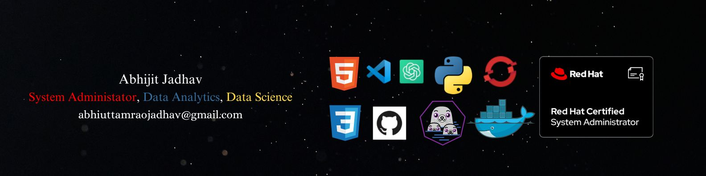

# 👋 Hi, I'm Abhijit Jadhav

📍 Pune, India  
📧 [Gmail](mailto:mailto:jabhijitp@gmail.com) | 📱 +91 12345 67890 | [GitHub](https://github.com/abhijadhav4) | [LinkedIn](https://www.linkedin.com/in/abhijit-jadhav-80457222b/) | [Credly](https://www.credly.com/users/abhijit-jadhav.9678d86c/edit)  

---

## 🎯 Objective

Motivated and detail-oriented AI & Data Science student with a strong foundation in Python, Linux, and data analytics. Passionate about solving real-world problems and eager to contribute to dynamic teams.

---

## 🎓 Education

**B.Tech in AI and Data Science (2021–2025)**  
DBATU – MIT College  
*Relevant Coursework:* Python, SQL, Machine Learning

---

## 🛠️ Technical Skills

- **Languages:** Python, Bash, SQL (basic)
- **Libraries/Tools:** Pandas, NumPy, Power BI, Tableau
- **Platforms:** Linux (RHEL, Ubuntu), Git, VS Code, Jupyter Notebook
- **System Admin:** RHCSA, Scripting, Monitoring, User/Permission Management

---

## 🏅 Certifications

- Red Hat Certified System Administrator (RHCSA)
- Power BI and Tableau Certification – MIT
- Python – Kaggle

---

## 💡 Projects & Experience

- **Linux System Automation:** Bash & Python scripts for user management & log monitoring.
- **Data Visualization:** Dashboards using Power BI & Tableau, data analysis with Pandas & NumPy.
- **Version Control:** Git/GitHub for versioning, collaboration, and issue tracking.

---

## 🤝 Soft Skills

- Analytical and problem-solving abilities
- Excellent communication and teamwork
- Adaptability and eagerness to learn

---

## 📊 GitHub Stats

<!-- Optionally, you can add dynamic GitHub stats using the following: -->

---

## 🌐 Connect with Me

- [LinkedIn](https://www.linkedin.com/in/abhijit-jadhav-80457222b/)
- [Credly](https://www.credly.com/users/abhijit-jadhav.9678d86c)
- [GitHub](https://github.com/abhijadhav4)
- [Gmail](mailto:jabhijitp@gmail.com)

---

*Let's connect and collaborate on exciting projects!*

📄 Know about my experiences: **[My Resume](https://drive.google.com/file/d/13_wbGfJzebssAzTDfU12B-IWW-iYu_af/view?usp=sharing)**.
